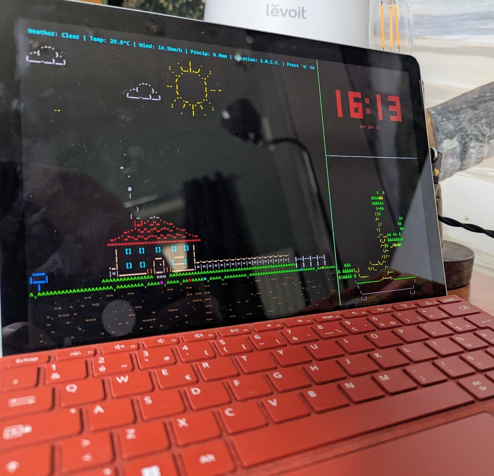

# Nabu — Local Offline Voice Assistant

A **100% local, offline** voice assistant for the home, built on [Home Assistant](https://www.home-assistant.io/) and the [Wyoming protocol](https://github.com/rhasspy/wyoming). No data ever leaves the local network: no cloud, no accounts, no telemetry.

The system runs distributed across **3 machines** connected over LAN.

---

## Architecture

```
┌──────────────────────────────┐
│  SATELLITE  (Surface Go)      │
│  ─ microphone + speaker       │
│  ─ linux-voice-assistant      │
│    (Wyoming satellite)        │
│  ─ local wake word            │
│  ─ KDE/Wayland screensaver    │
└───────────────┬──────────────┘
                │ LAN (Wyoming protocol)
                ▼
┌──────────────────────────────┐
│  HOME ASSISTANT  (server)     │
│  ─ homeassistant   :8123      │
│  ─ openwakeword    :10400     │  detects "okay nabu"
└───────┬───────────────┬──────┘
        │               │
        ▼               ▼
┌──────────────┐ ┌──────────────┐
│  AI SERVER    │ │  AI SERVER    │
│  faster-      │ │  piper-tts    │
│  whisper      │ │  :10200       │
│  :10300       │ │  text→speech  │
│  speech→text  │ │  (it_IT       │
│  (it, large-  │ │   riccardo)   │
│   v3-turbo)   │ │               │
└──────────────┘ └──────────────┘
```

> **Note:** `home-assistant/` and `ai-server/` can run on the same machine or on separate ones — they are split into distinct compose files for flexibility.

---

## Voice request flow

1. **Wake word** — the satellite (or `openwakeword`) listens continuously and triggers on the keyword.
2. **STT** — audio is sent to `faster-whisper` → transcribed to text (Italian).
3. **Intent** — Home Assistant interprets the text and runs the action (lights, scenes, questions…).
4. **TTS** — the text response goes to `piper-tts` → audio.
5. **Playback** — the audio returns to the satellite and is played back.

Everything happens **on the LAN**, with zero external connections.

---

## Components

### `ai-server/` — STT + TTS

| Service | Port | Role | Config |
|---------|------|------|--------|
| `faster-whisper` | 10300 | Speech→Text | model `large-v3-turbo`, language `it`, `int8`, 12 CPU threads |
| `piper-tts` | 10200 | Text→Speech | voice `it_IT-riccardo-x_low` |

```bash
cd ai-server && docker compose up -d
```

### `home-assistant/` — HA core + wake word

| Service | Port | Role | Config |
|---------|------|------|--------|
| `homeassistant` | 8123 | Core (host network) | linuxserver image, TZ `Europe/Rome` |
| `openwakeword` | 10400 | Wake word detection | model `okay_nabu` |

```bash
cd home-assistant && docker compose up -d
```

> ⚠️ Before starting: replace `/path/to/your/ha/config` in `home-assistant/docker-compose.yml` with your real HA config path.

### `satellite/` — voice device + display

A PC with microphone and speaker (e.g. Surface Go) running [`linux-voice-assistant`](https://github.com/OHF-Voice/linux-voice-assistant).

- **Active wake word:** `hey_rhasspy` (configurable in `preferences.json`)
- **Available wake words:** `okay_nabu`, `hey_jarvis`, `alexa`, `hey_mycroft`, `hey_luna`, `hey_home_assistant`, `okay_computer`, `choo_choo_homie`, `stop`
- **Screensaver:** after 120s of inactivity (`swayidle`) it opens Kitty fullscreen with 3 panels — weather, clock, animated bonsai.



Full details in [`satellite/README.md`](satellite/README.md).

---

## Quick start

```bash
# 1. AI server (STT + TTS)
cd ai-server && docker compose up -d

# 2. Home Assistant + wake word
cd ../home-assistant
# edit the config path in the compose file, then:
docker compose up -d

# 3. Satellite
# see satellite/README.md
```

In Home Assistant, configure the **Wyoming** integration pointing to the services:
- Whisper → `<ai-server-ip>:10300`
- Piper → `<ai-server-ip>:10200`
- openWakeWord → `<ha-ip>:10400`

---

## Example hardware

| Role | Machine |
|------|---------|
| Satellite | Surface Go (KDE/Wayland) |
| Home Assistant + AI | Mini-PC server (powered on via Wake-on-LAN) |

---

## Privacy

- **No cloud.** STT, TTS, wake word and intent processing all run entirely locally.
- No dependency on external services (Alexa, Google, OpenAI…).
- Models (Whisper, Piper, openWakeWord) are downloaded once and stored in local volumes.
